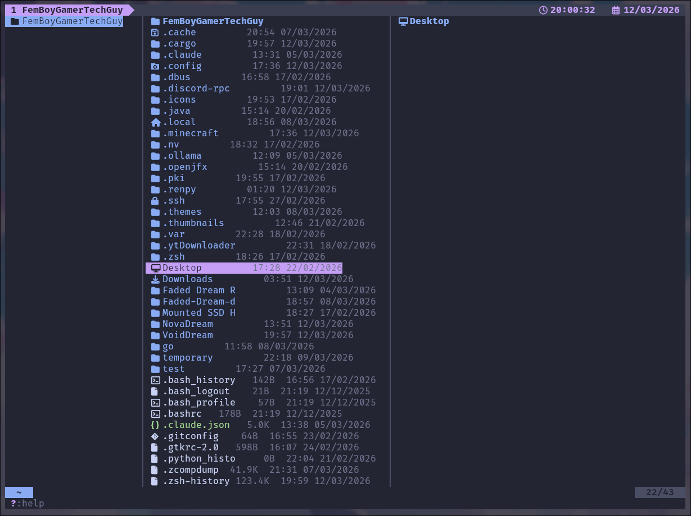
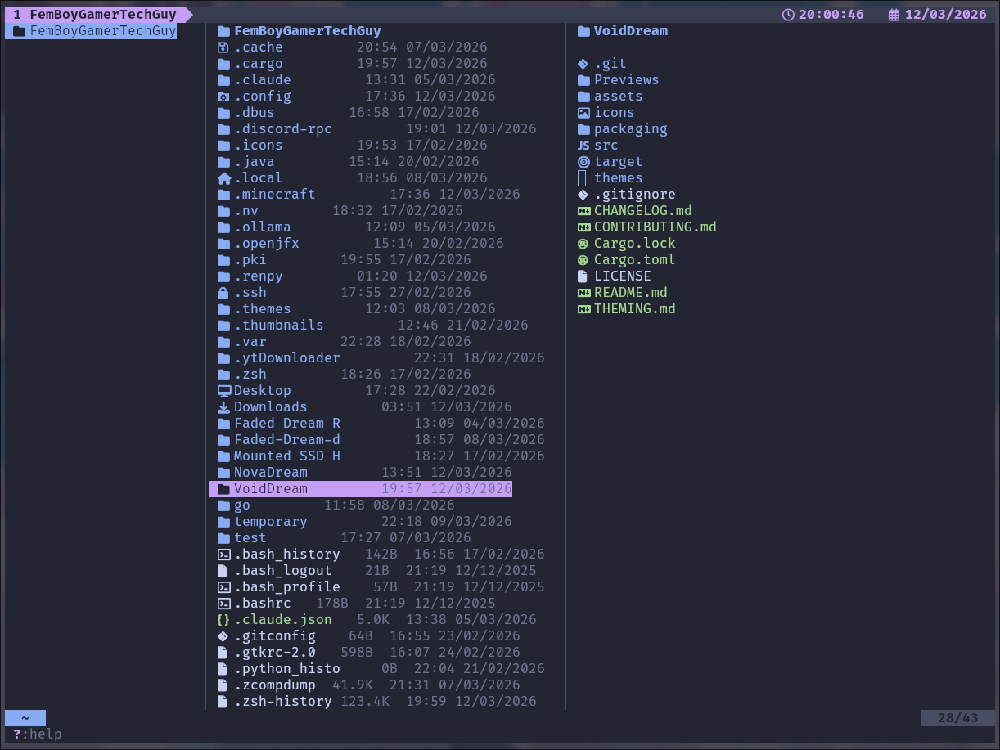
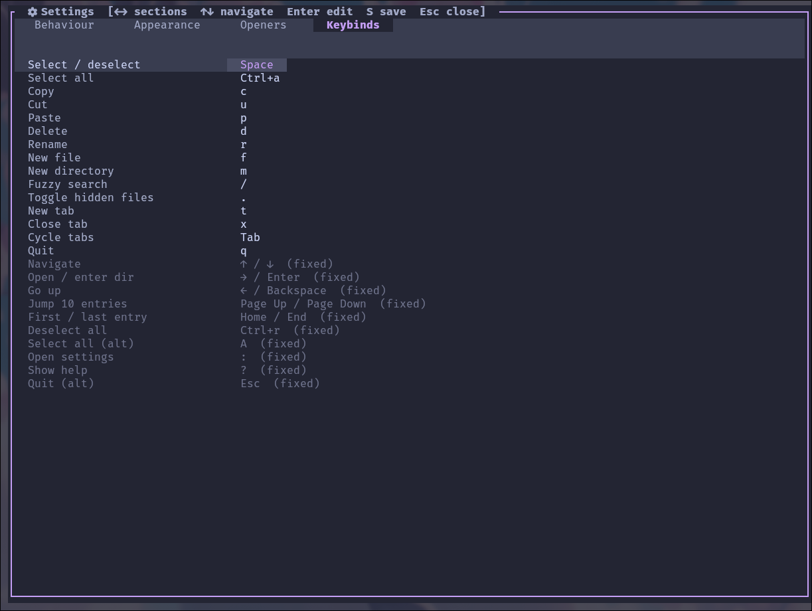
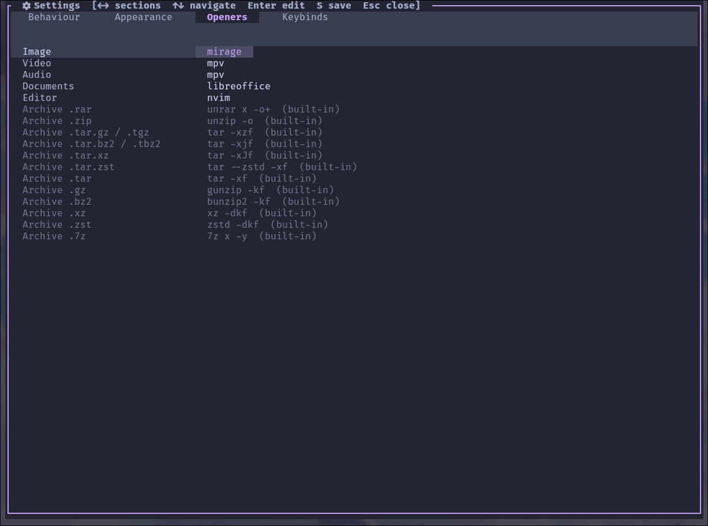

<div align="center">

# VoidDream

**A dreamy void-themed TUI file manager built with Rust and Ratatui.**

[](LICENSE)
[](https://www.rust-lang.org/)
[](https://www.rust-lang.org/)
[](CHANGELOG.md)
[-orange?style=flat-square)](CHANGELOG.md)
[](https://github.com/FemBoyGamerTechGuy/Faded-Dream-dotfiles)

</div>

---

## Overview

VoidDream is a fast, keyboard-driven file manager for the terminal. It features a classic three-pane layout, live file previews, fuzzy search, multi-tab navigation, and a fully themeable interface — all configurable without touching a config file manually.

> **Development is temporarily on pause.** I'm shifting focus to two other projects that I believe will make a real impact on the Linux ecosystem. VoidDream is not abandoned — bug fixes will still land, and I'll be back when those projects are done.

---

## Previews

<div align="center">

 
 

</div>

---

## Features

| | Feature |
|---|---|
| 🗂️ | **3-pane layout** — parent / files / preview |
| 🗃️ | **Multi-tab support** |
| 🔍 | **Fuzzy search** with live streaming results |
| 🖼️ | **Image & video preview** — including RAW, HEIC, HDR, EXR and more via ffmpeg fallback |
| 🕐 | **Live clock** in tab bar with local timezone, toggleable file date/time column |
| 🎨 | **21 built-in themes** + community theme support |
| 🔤 | **Nerd Font, Emoji, Minimal and None** icon sets |
| ⌨️ | **Fully configurable keybinds** — every key changeable, with multi-binding and combo support |
| ✏️ | **Cursor editing in rename/new file** — move, jump to start/end, delete at cursor position |
| 📂 | **Configurable file openers** per file type |
| 📦 | **Native archive extraction** — ZIP, TAR, GZ, BZ2, XZ, ZST via pure Rust; RAR via `unrar` |
| 📁 | **Folder size display** — async, non-blocking, matches file manager readings |
| 🖱️ | **Open-with menu** (`k`) — pick any app to open a file, or type a custom command |
| 🌐 | **HTML support** — opens in configured browser, configurable separately |
| 💾 | **Drive / USB / phone manager** (`Shift+D`) — mount and unmount drives and Android phones |
| 🌍 | **12 languages** — EN, RO, FR, DE, ES, IT, PT, RU, JA, ZH, KO, AR |
| 🎉 | **First-run welcome screen** — guided setup on first launch |
| ⚙️ | **Settings UI** with live apply, organised keybinds section, About, scrollable help |

---

## Installation

See **[packaging/README.md](packaging/README.md)**.

### Runtime apps

See **[scripts/README.md](scripts/README.md)**.

---

## Configuration

Config is stored at `~/.config/VoidDream/config.json` and is created automatically on first launch with sane defaults.

| Key | Default | Description |
|-----|---------|-------------|
| `theme` | `catppuccin-macchiato` | Active theme |
| `icon_set` | `nerdfont` | `nerdfont` / `emoji` / `minimal` / `none` |
| `show_hidden` | `true` | Show hidden files |
| `date_format` | `%d/%m/%Y %H:%M` | Date format in file list |
| `show_clock` | `true` | Live clock in tab bar |
| `show_file_mtime` | `true` | Date/time column in file list |
| `language` | `English (UK)` | UI language (12 options available) |
| `opener_browser` | *(auto-detected)* | Browser for HTML files |
| `opener_image` | `mirage` | Image opener |
| `opener_video` | `mpv` | Video opener |
| `opener_audio` | `mpv` | Audio opener |
| `opener_doc` | `libreoffice` | Document opener |
| `opener_editor` | `nvim` | Text editor |

---

## Keybinds

All configurable keybinds can be changed from the settings UI — press `:` to open it.

| Key | Action | Key | Action |
|-----|--------|-----|--------|
| `↑` / `↓` | Navigate | `Space` | Select / deselect |
| `→` / `Enter` | Open / enter dir | `Ctrl+a` / `A` | Select all |
| `←` / `Backspace` | Go up | `Ctrl+r` | Deselect all |
| `Page Up/Down` | Jump 10 entries | `/` | Fuzzy search |
| `Home` / `End` | First / last entry | `.` | Toggle hidden files |
| `c` | Copy | `Tab` | Cycle tabs |
| `u` | Cut | `t` | New tab |
| `p` | Paste | `x` | Close tab |
| `d` | Delete | `:` | Settings |
| `r` | Rename | `?` | Help (scrollable) |
| `f` | New file | `k` | Open with… |
| `m` | New directory | `Shift+D` | Drive manager |
| `q` / `Esc` | Quit | | |

---

## Theming

Themes live in `~/.local/share/VoidDream/themes/` as JSON files and are loaded automatically on launch. Drop any `.json` file there and it will appear in the Settings theme picker instantly.

**21 built-in themes** including Catppuccin (all four flavours), Dracula, Tokyo Night, Nord, Gruvbox, Rosé Pine, Everforest, Kanagawa and more.

For the full theme JSON format and icon reference, see [THEMING.md](THEMING.md).

---

## Project Structure

```
VoidDream/
├── src/
│   ├── main.rs              # Entry point
│   ├── config.rs            # Theme, IconData, Config, SettingsState
│   ├── types.rs             # FileKind, InputMode, Tab, file-type lists, helpers
│   ├── app.rs               # App struct and all logic
│   ├── extract.rs           # Native archive extraction engine
│   ├── drives.rs            # Drive / USB / phone mount manager
│   ├── lang.rs              # Internationalisation strings (12 languages)
│   ├── ui.rs                # All TUI drawing functions
│   └── keys.rs              # Keyboard input handlers
├── assets/
│   └── desktop/
│       └── io.github.FemBoyGamerTechGuy.VoidDream.desktop
├── icons/
│   ├── emoji.json
│   ├── minimal.json
│   ├── nerdfont.json
│   └── none.json
├── packaging/
│   ├── README.md
│   ├── PKGBUILD
│   ├── build-deb.sh
│   ├── build-rpm.sh
│   └── build-packages.sh
├── Previews/
├── themes/
│   └── *.json               # 21 built-in themes
├── scripts/
│   ├── README.md
│   ├── install-deps-arch.sh
│   ├── install-deps-debian.sh
│   └── install-deps-fedora.sh
├── .gitignore
├── CHANGELOG.md
├── CONTRIBUTING.md
├── Cargo.toml
├── LICENSE
├── README.md
└── THEMING.md
```

---

## Part of Faded Dream

VoidDream is part of the [Faded Dream dotfiles](https://github.com/FemBoyGamerTechGuy/Faded-Dream-dotfiles) ecosystem.

---

## License

Copyright (C) 2026 FemBoyGamerTechGuy. All rights reserved.

This project is licensed under the **VoidDream Proprietary License v1.0**.

Personal use is free and unrestricted (privately). Forking, redistribution, and commercial use all require explicit written permission from the author. The license cannot be removed, replaced, or relicensed by anyone other than the author. Violations may result in a DMCA takedown, cease and desist, or legal action.

See the [LICENSE](LICENSE) file for the full license text.
